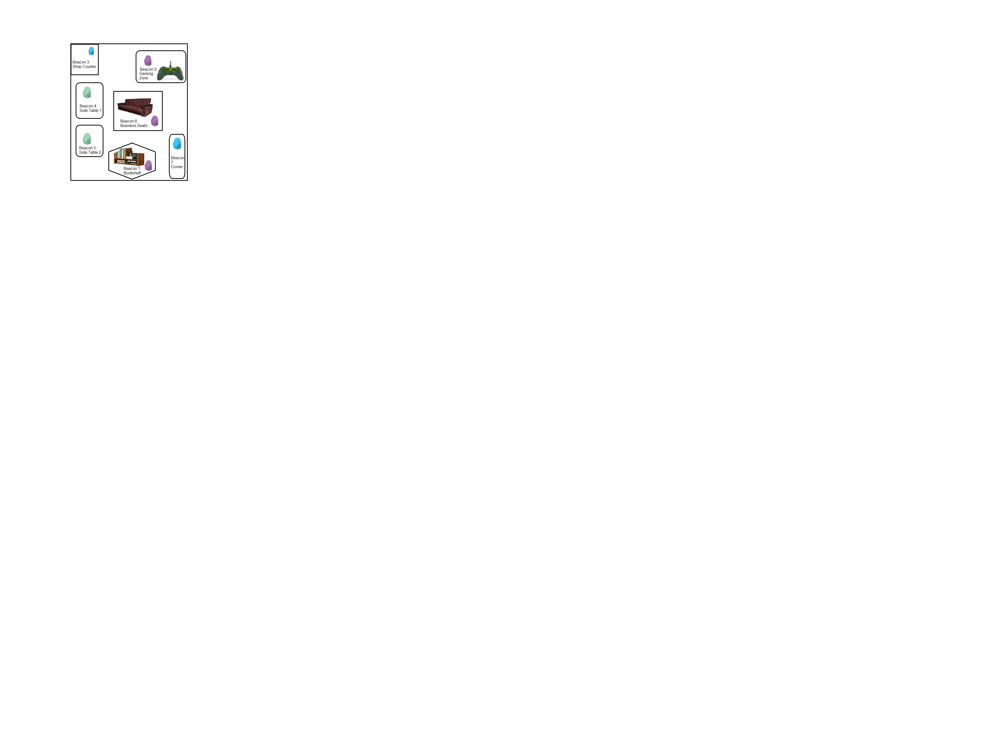

# coffee-shop-clustering
Using customer sequence data, create cluster based on customer behaviour in coffee shop

Each customer reading was converted to a sequence. Noisy readings were labeled as ‘Unknown’, because they could result from a person moving around the coffee shop continuously. Other sequences was labeled according to the behavior around the 7 zones.

Common distance algorithms such as Euclidean and Manhattan distance was not appropriate for sequential data. Instead, the Optimal Matching (OM), the Longest Common Prefix (LCP) and the Longest Common Subsequence (LCS) distances were used.

